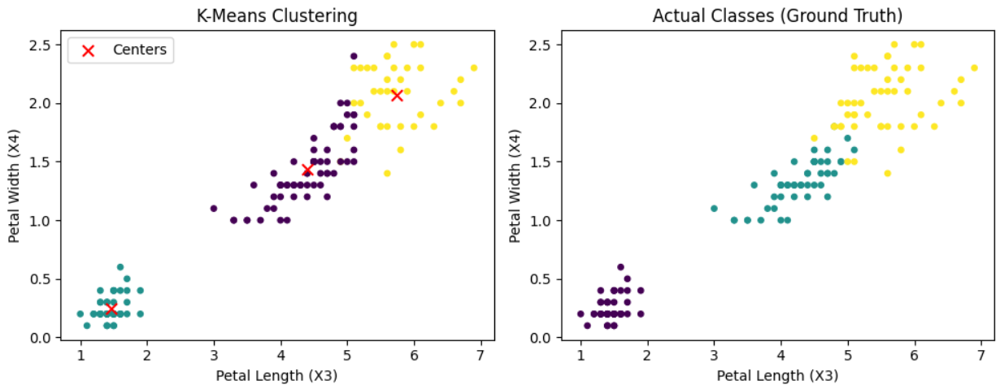

# 🌸 Iris Dataset Clustering with KMeans  
(خوشه‌بندی دیتاست آیریس با الگوریتم KMeans)

---

## 📚 About the Project | درباره پروژه

This project demonstrates how to perform unsupervised clustering on the classic Iris dataset using the KMeans algorithm.  
We load the Iris dataset, apply KMeans clustering to group the flowers into 3 clusters, and visualize the results alongside the actual species labels.  

این پروژه نشان می‌دهد چگونه می‌توان خوشه‌بندی بدون نظارت (Unsupervised Clustering) را روی دیتاست معروف آیریس با الگوریتم KMeans انجام داد.  
در این پروژه، دیتاست آیریس بارگذاری شده، سپس با KMeans خوشه‌بندی به ۳ خوشه انجام می‌شود و نتایج خوشه‌بندی همراه با برچسب‌های واقعی گونه‌های گل به صورت تصویری نمایش داده می‌شود.

---

## 🧩 Dataset Features | ویژگی‌های دیتاست

| Index | Feature Name    | شرح ویژگی              |
|-------|-----------------|------------------------|
| 0     | Sepal Length    | طول کاسبرگ             |
| 1     | Sepal Width     | عرض کاسبرگ             |
| 2     | Petal Length    | طول گلبرگ              |
| 3     | Petal Width     | عرض گلبرگ              |

---

## 🔧 Technologies Used | تکنولوژی‌های استفاده شده

- Python 3.x  
- NumPy  
- Matplotlib  
- Scikit-learn (for dataset and KMeans)

---

## 🚀 How to Run | نحوه اجرای پروژه

1. Make sure you have Python 3 installed.  
2. Install required packages:

   ```bash
   pip install numpy matplotlib scikit-learn

---
نمودار خوشه‌بندی K-Means روی دیتاست Iris
این نمودار در سمت چپ نتایج خوشه‌بندی الگوریتم K-Means را روی دو ویژگی طول و عرض گلبرگ (Petal Length و Petal Width) نشان می‌دهد. نقاط قرمز رنگ با علامت ضربدر (×) مراکز خوشه‌ها هستند.
نمودار سمت راست کلاس‌های واقعی (Ground Truth) نمونه‌ها را نمایش می‌دهد که برای مقایسه با خوشه‌بندی به کار می‌رود.


K-Means Clustering Plot on Iris Dataset
The left plot shows the clustering results of the K-Means algorithm on two features: Petal Length and Petal Width. Red crosses (×) represent the cluster centers.
The right plot displays the actual classes (Ground Truth) of the samples for comparison





---
## About Me | درباره من

👋 My name is **Abolfazl Karimi**. I am a professional AI programmer specializing in developing real-world machine learning and deep learning projects. 
📫 Contact me via Email: karimiabolfazl466@gmail.com  
📱 Telegram: [@Abolfazlk83](https://t.me/Abolfazlk83)   
🌐 LinkedIn: ***  
🐙 GitHub: [github.com/abolfazlkarimi83](https://github.com/abolfazlkarimi83)

---

👋 من **ابوالفضل کریمی** هستم، برنامه‌نویس حرفه‌ای هوش مصنوعی با تخصص در توسعه پروژه‌های عملی یادگیری ماشین و یادگیری عمیق.  
📫 ایمیل: karimiabolfazl466@gmail.com  
📱 تلگرام: [@Abolfazlk83](https://t.me/Abolfazlk83)  
🌐 لینکدین: *** 
🐙 گیت‌هاب: [github.com/abolfazlkarimi83](https://github.com/abolfazlkarimi83)

